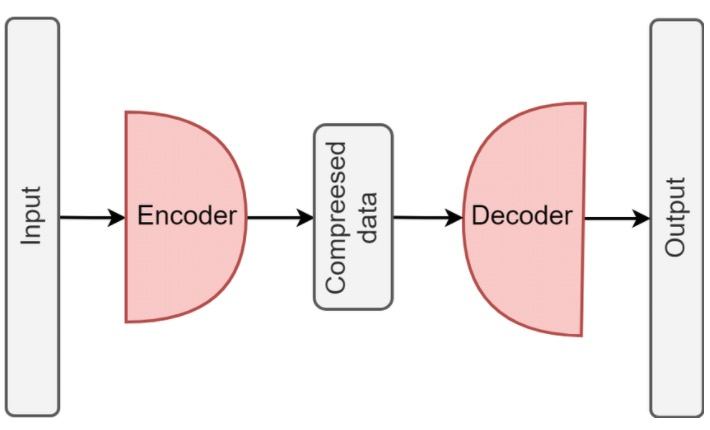
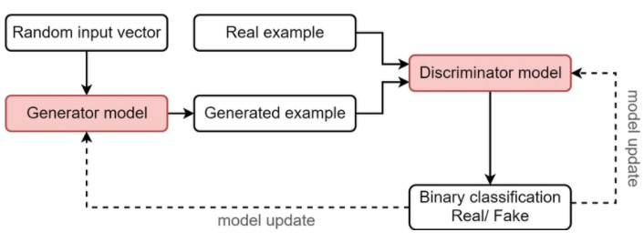

# Generative Adversarial Networks Cheat Sheet

### Table of Contents

### Introduction

#### Generative Models vs. Discriminative Models

| Discriminative Models         | Generative Models                           |
| ----------------------------- | ------------------------------------------- |
| Features :arrow_right:  Class | Random Noise, Class :arrow_right:  Features |

#### Generative Models 

| Variational Autoencoders (VAEs) | Generative Adversarial Networks (GANs) |
| ------------------------------- | -------------------------------------- |
|              |                     |

#### GANs Applications

| StyleGAN2                 | CycleGAN                   | GauGAN          |
| ------------------------- | -------------------------- | --------------- |
| Generate :man::dog2::cat: | Image-to-image translation | Image Synthesis |

| Adobe              | Google          | IBM               | SnapChat      | Disney           |
| ------------------ | --------------- | ----------------- | ------------- | ---------------- |
| Next-gen Photoshop | Text Generation | Data Augmentation | Image Filters | Super-resolution |

